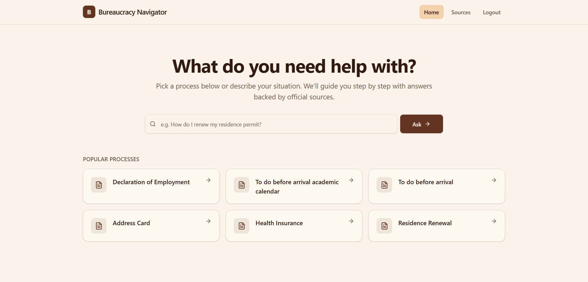
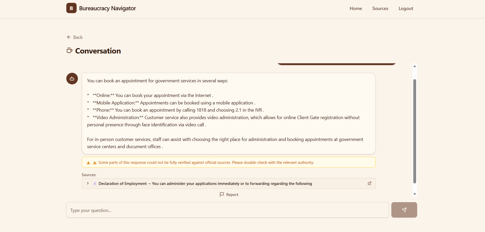
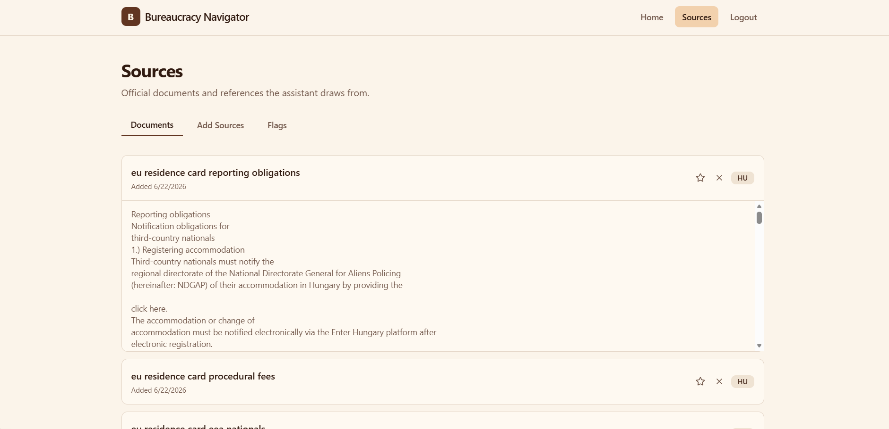

# BureauBot-AI

AI-powered chatbot for navigating government administrative procedures with zero-hallucination RAG (Retrieval-Augmented Generation).

## Screenshots




## Screenshots

### Home & Quick Actions
Pick a process or describe your situation to get step-by-step guidance.


### Conversational Interface
Ask questions and get answers complete with source citations and verification warnings.


### Source Library
View and manage the official documents and references the assistant draws from.


### Add New Sources
Easily expand the assistant's knowledge base by importing from a URL or pasting text manually.


## Demo


## Features

- **Multi-query RAG pipeline** — expands user questions into multiple variants for better retrieval
- **Hybrid retrieval** — combines dense vector search (ChromaDB) with sparse keyword search (BM25)
- **RAG Fusion** — reciprocal rank fusion across multiple result lists
- **Cross-encoder reranking** — reranks candidates for precision using ms-marco-MiniLM
- **Confidence gate** — refuses to answer when evidence is insufficient rather than hallucinating
- **Citation verification** — post-generation check flags ungrounded factual claims
- **SSE streaming** — real-time token streaming to the frontend
- **Admin panel** — document ingestion, web crawling, error logs, user feedback

## Tech Stack

| Layer | Technology |
|-------|-----------|
| LLM | Google Gemini 2.5 Flash Lite |
| Embeddings | sentence-transformers (all-MiniLM-L6-v2) |
| Reranker | cross-encoder/ms-marco-MiniLM-L-6-v2 |
| Vector DB | ChromaDB |
| API | FastAPI + Uvicorn |
| Database | PostgreSQL (asyncpg + SQLAlchemy) |
| Auth | JWT + bcrypt |
| Frontend | React 18, TypeScript, Vite, Tailwind CSS |

## Setup

### Prerequisites

- Python 3.11+
- Node.js 18+
- Docker (for PostgreSQL)

### Backend

```bash
# Start PostgreSQL
docker compose up -d

# Create virtual environment
cd backend
python -m venv ../.venv
source ../.venv/bin/activate  # or ..\.venv\Scripts\activate on Windows

# Install dependencies
pip install -r requirements.txt

# Configure environment
cp .env.example .env
# Edit .env and add your Gemini API key

# Run the API
python -m backend.main
```

### Frontend

```bash
cd frontend
npm install
npm run dev
```

The frontend runs on `http://localhost:3000` and the API on `http://localhost:8000`.

## Testing

```bash
# Backend tests
pytest

# Frontend tests
cd frontend && npm test
```

## Project Structure

```
backend/
├── api/          # Routes, schemas, dependencies
├── db/           # SQLAlchemy models, session management
├── hallucination/# Confidence gate, citation verifier
├── rag/          # Retriever, reranker, chunker, fusion, multi-query
├── services/     # Chat orchestration, ingestion, crawler, auth
├── config.py     # Settings from environment
└── main.py       # FastAPI app entry point

frontend/
├── src/
│   ├── components/  # UI components
│   ├── pages/       # Chat, Home, Sources, Login, Register
│   └── lib/         # API client, auth helpers

tests/            # Unit + integration tests
corpus/           # Demo administrative documents
```
